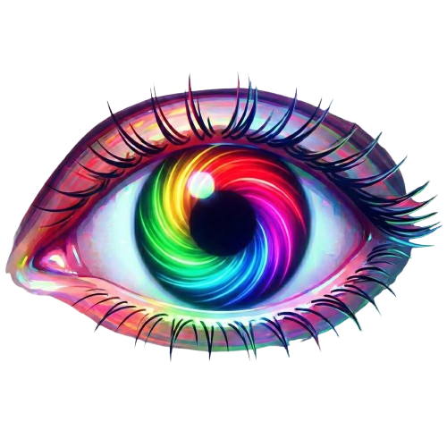

# Retina - RGB Color Sense Game



Retinaは、RGB数値を推測して色彩感覚を極限まで高めるブラウザゲームです。
インストール不要で、PC・スマホからすぐに遊べます。

## 🎮 Play Now
**[https://takutonkatsu.github.io/Retina/](https://takutonkatsu.github.io/Retina/)**

## ✨ Features
- **Origin**: 数値のみで挑むスタンダードモード
- **Rush**: 時間制限付きのスピード勝負
- **Survival**: 一度のミスも許されないサバイバル
- **Versus**: 2〜4人でリアルタイム対戦
- **Daily Color**: 世界共通の「今日の色」に挑戦

## 🛠 Built With
- HTML5 / CSS3 / JavaScript (Vanilla)
- Firebase Realtime Database (for Versus mode)
- Capacitor / AdMob (for mobile app builds)

## 📱 iPhone App Build

```bash
npm install
npm run cap:sync
npm run cap:ios
```

The mobile build uses Google AdMob test IDs by default.
Before release, replace the banner ad unit ID in `script.js` and the iOS app ID in:

- `ios/App/App/Info.plist`

The app is intended for iPhone release. The bottom banner is fixed, and the web UI reserves space above it.

## 🔐 Privacy Policy

App Store Connect privacy policy URL:

```text
https://takutonkatsu.github.io/Retina/privacy.html
```

© 2023-2026 Takutonkatsu
